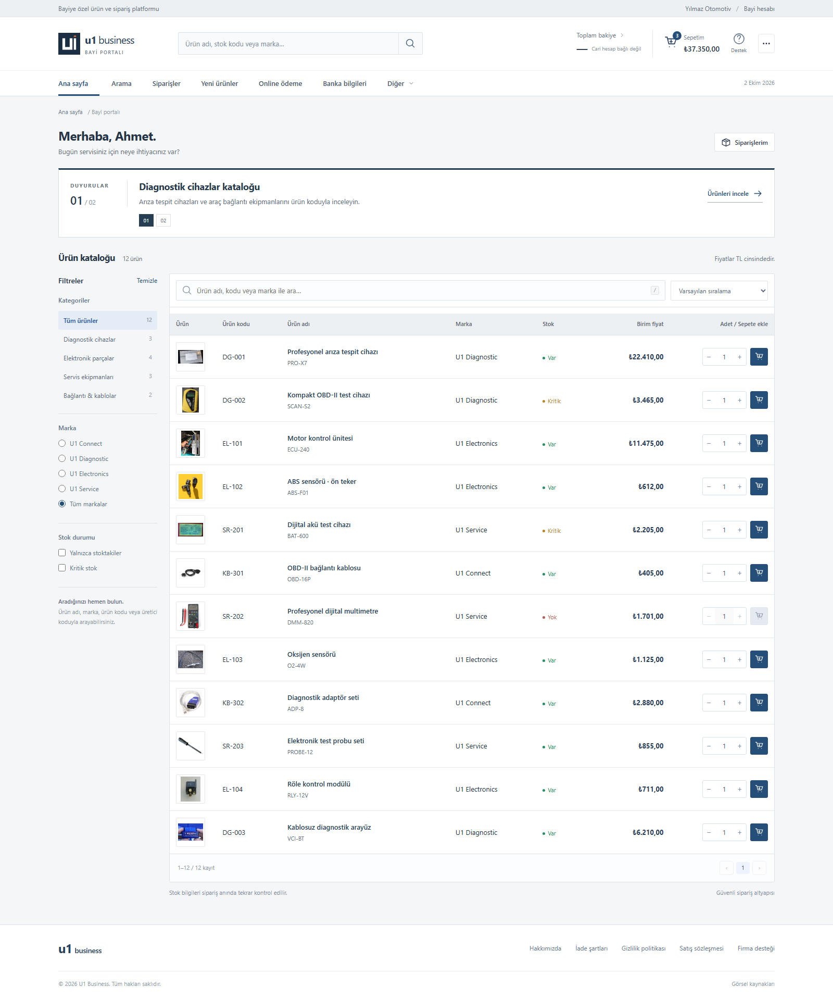
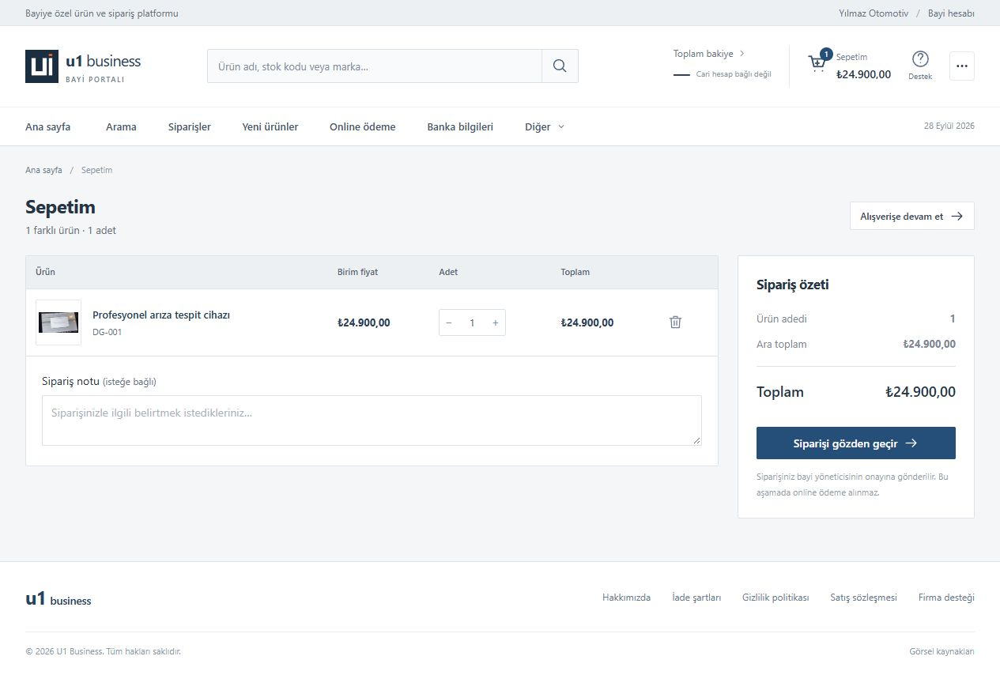
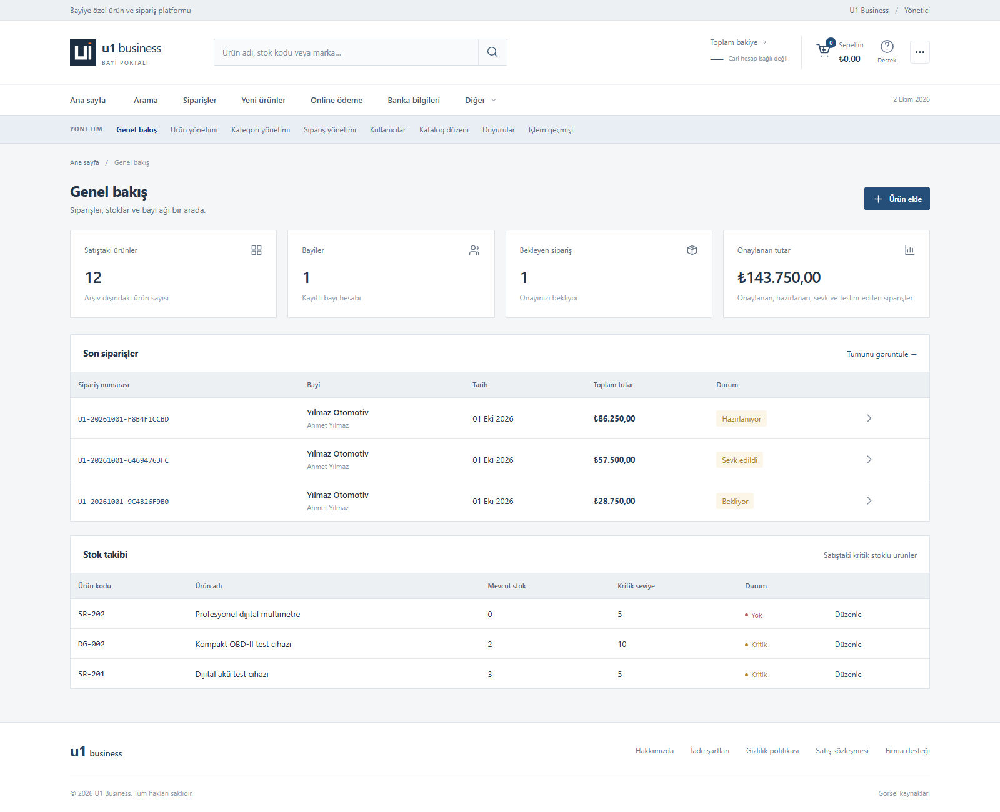

# U1 Business — B2B bayi sipariş uygulaması

U1 Business, bayi ve yöneticilerin kullandığı küçük bir B2B e-ticaret uygulamasıdır. Bayi ürünleri arar, sepete ekler ve sipariş oluşturur. Yönetici ürünleri ve bayi hesaplarını düzenler, siparişleri onaylar veya reddeder. Uygulama **ASP.NET Core 10**, **Entity Framework Core**, **SQL Server** ve HTML/CSS/JavaScript ile geliştirilmiştir. Ayrı frontend sunucusu veya Node.js kurulumu gerekmez.

Bu depo çalışır **kaynak kodu** içerir. Varsayılan kurulum Windows'ta SQL Server LocalDB kullanır. Demo ürünler, fiyatlar, kullanıcılar ve firma metinleri gerçek ticari veri değildir. Uygulama ödeme veya cari hesap sistemi değildir.

## Arayüzden görüntüler

Aşağıdaki ekranlar çalışan uygulamadan, yalnız örnek bayi ve ürün verileriyle alınmıştır (28 Eylül 2026).

### Bayi kataloğu

Kategori ve stok filtreleri, ürün arama, fiyatlar ve satırdan sepete ekleme.



<details>
<summary>Sepet ve yönetim panelini göster</summary>

### Sepet ve sipariş özeti



### Yönetim paneli



</details>

## Kullanılan teknolojiler ve kısa mimari özeti

| Teknoloji | Kullanımı |
| --- | --- |
| .NET 10 / ASP.NET Core Minimal API | Web sunucusu, API ve kimlik doğrulama |
| SQL Server; yerel geliştirmede Express LocalDB | Kalıcı kullanıcı, ürün, sepet ve sipariş verileri |
| Entity Framework Core SQL Server ve Microsoft.Data.SqlClient | Uygulama veri erişimi, transaction yönetimi ve SQL Server'a özgü kilit/bağlantı işlemleri |
| HTML, CSS, JavaScript ES modules | Tarayıcı arayüzü; ayrı frontend derlemesi yok |

**Mimari tercih:** Tek uygulama hem arayüzü hem API'yi aynı adresten sunar. Kod, `Domain`, `Data`, `Services`, `Endpoints` ve `wwwroot` klasörleriyle sorumluluklara ayrılmıştır. Katalog arama ve sayfalama SQL Server'da yapılır; ürün tablosunun kolonları veritabanındaki ayarlardan oluşturulur. Sipariş oluşturma ve stok düşümü tek SQL transaction içinde tutulur. Küçük proje ölçeği için ayrı frontend sunucusu veya mikroservis kullanılmamıştır. Ayrıntılar aşağıdaki “Teknik yapı ve iş kuralları” bölümündedir.

## Depo yapısı

```text
U1-Business/
  README.md                  Bu kurulum ve kullanım kılavuzu
  assets/screenshots/        README için demo arayüz görselleri
  U1.Business.sln            Visual Studio çözümü
  global.json                .NET SDK sürüm politikası
  src/U1.Business/
    U1.Business.csproj       Proje ve NuGet bağımlılıkları
    Program.cs               Sunucu, kimlik, güvenlik, API başlangıcı
    Domain/                  Veri modelleri ve giriş doğrulama
    Data/                    SQL şeması, yükseltmeler, örnek veriler
    Services/                Sipariş ve stok işlemleri
    Endpoints/               Kimlik, katalog, sepet ve sipariş API yolları
      Admin/                 Yönetim API yolları: ürün, kullanıcı, sipariş, grid, duyuru
    wwwroot/                 Canlı arayüz, stiller, yerel ürün görselleri
      admin/                 Yönetim ekranları ve form işlemleri
```

`src/U1.Business/wwwroot/index.html` doğrudan dosya olarak açılmaz. Uygulamayı sunucudan `http://localhost:5080` adresiyle kullanın. Veritabanı depoya dahil değildir; ilk açılışta SQL Server'da oluşturulur.

## Gereksinimler

- Windows 10/11 ve [.NET 10 SDK](https://dotnet.microsoft.com/download/dotnet/10.0). Yalnız ASP.NET Runtime yeterli değildir. `global.json` 10.0.100 tabanından .NET 10 içerisindeki daha yeni özellik bantlarına ve yamalara ilerlemeye izin verir; proje 10.0.401 ile doğrulandı. [.NET 10 LTS destek politikasına](https://dotnet.microsoft.com/en-us/platform/support/policy) dahildir.
- Visual Studio ile geliştirme için [Visual Studio 2026 sürüm 18.0 veya yenisi](https://learn.microsoft.com/dotnet/core/install/windows) ve **ASP.NET and web development** iş yükü. Visual Studio uygulamayı çalıştırmak için şart değildir.
- [SQL Server Express LocalDB](https://learn.microsoft.com/sql/database-engine/configure-windows/sql-server-express-localdb) veya erişebildiğiniz bir SQL Server. LocalDB yalnız Windows'ta çalışır. İlk kurulumda SQL hesabının veritabanı oluşturma ve şema değiştirme yetkisi gerekir.
- Güncel bir tarayıcı. Visual Studio, Node.js, Python, Docker ve SSMS uygulamayı kullanmak için zorunlu değildir.
- İlk `dotnet restore` için NuGet paketlerine internet erişimi; paketler önbellekteyse gerekmez.

ZIP'i yazılabilir bir klasöre çıkarın. Yeni bir PowerShell penceresinde `dotnet --info` ile SDK'yı, gerekirse `sqllocaldb info MSSQLLocalDB` ile LocalDB örneğini kontrol edin.

## Visual Studio ile açma

1. Depoyu klonlayın veya ZIP'i çıkarın. `U1.Business.sln` dosyasını Visual Studio 2026'da açın. Visual Studio'nun önerdiği NuGet paket geri yüklemesini tamamlayın.
2. SQL Server Express LocalDB kuruluysa araç çubuğundan `http` profilini seçip **F5** ile çalıştırın. İlk açılış şemayı ve örnek verileri oluşturur.
3. Farklı SQL Server kullanacaksanız `src/U1.Business/appsettings.Local.json` dosyasını aşağıdaki örneğe göre oluşturun. Bu dosya Git'e alınmaz. Ardından yeniden F5'e basın.

ASP.NET Core, .NET'in web uygulaması çatısıdır; bu projenin backend'i .NET 10 ile çalışır. Visual Studio çözümü, kaynak projeyi ve NuGet bağımlılıklarını birlikte açar. `bin`/`obj` klasörleri teslimin parçası değildir; ilk geri yükleme ve derlemede yeniden üretilir.

## Hızlı başlangıç — Windows

1. `U1.Business.sln` dosyasını Visual Studio 2026 ile açın, `http` profilini seçin ve F5 ile çalıştırın.
2. İlk açılışta paket geri yüklemesi, derleme ve veritabanı kurulumu birkaç dakika sürebilir. Konsolda `Now listening on: http://localhost:5080` satırını bekleyin.
3. Tarayıcıda [http://localhost:5080](http://localhost:5080) adresini açın.
4. Aşağıdaki geliştirme hesaplarıyla giriş yapın veya **Hesap oluşturun** bağlantısıyla yeni bayi açın.

| Rol | E-posta | Parola |
| --- | --- | --- |
| Yönetici | `admin@u1.local` | `U1Admin!2026` |
| Örnek bayi | `bayi@u1.local` | `U1Bayi!2026` |

Bu hesaplar yalnız `Development` ortamında ve kullanıcı tablosu boşsa oluşturulur. Gerçek kullanım için değildir. Konsolu kapatmak veya Ctrl+C uygulamayı durdurur; SQL Server'daki veri kalır.

Alternatif olarak depo kökünde .NET CLI ile çalıştırabilirsiniz:

```powershell
dotnet restore src/U1.Business/U1.Business.csproj
dotnet run --project src/U1.Business/U1.Business.csproj --no-launch-profile -- --urls http://localhost:5080 --environment Development
```

`--no-launch-profile` kullanırken örnek hesaplar için `Development` ortamını açıkça verin. Farklı port için `5080` yerine boş bir port yazın. 5080 zaten kullanılıyorsa açık uygulamayı kullanın veya portu değiştirin.

## Bayi olarak kullanım

1. Kayıtta ad, soyad, telefon, e-posta ve en az 10 karakterli parola girin. Firma adı isteğe bağlıdır. Kayıt sonrasında otomatik giriş yapılır.
2. **Ana sayfa** duyuruları gösterir. **Arama** ekranında ürün adı/kodu, marka, üretici kodu ve diğer metinsel alanlarda arayın; kategori, marka, stok filtreleri, sıralama ve sayfalama kullanın. **Yeni ürünler** en son eklenenleri gösterir.
3. Ürün adına basıp detay penceresini açın. Stok işaretleri: **Var** (kritik eşikten fazla), **Kritik** (0'dan fazla ve eşiğe eşit/altında), **Yok** (0).
4. Satırdan veya detaydan adet seçip **Sepete ekle** deyin. Aynı ürünün adetleri tek satırda birleşir. **Sepetim** ekranında adedi değiştirin veya ürünü çıkarın. Bir ürün sepetinde en fazla 1.000.000 adet tutulur.
5. İsterseniz sipariş notu girin. **Siparişi gözden geçir** ekranında satırları ve toplamı inceleyin. **Siparişi oluştur** dediğinizde sunucu stok ve fiyatı yeniden denetler. Sepet veya fiyat değişmişse yeni bilgileri ayrıca onaylamanız istenir.
6. **Siparişlerim** ekranında numara, tarih, toplam, durum ve kalemleri görün. İlk durum **Bekliyor**'dur; yönetici kararı sonrası liste yenilenince **Onaylandı** veya **Reddedildi** görünür. Red halinde stok iade edilir.

Üstteki sepet özeti gerçek adet ve toplamı gösterir. **Hesabım** kişi/firma bilgilerini gösterir; bayi bu sürümde profilini kendisi düzenlemez. **Destek**, **Online ödeme**, **Banka bilgileri** ve **bakiye** alanları bilgi/örnek ekranlarıdır; gerçek ödeme almaz ve geçerli IBAN sunmaz. Hakkımızda, İade, Gizlilik ve Satış sözleşmesi sayfalarındaki metinler de örnektir.

## Yönetici olarak kullanım

Yönetici hesabıyla girişten sonra sağ üstte **üç nokta → Yönetim paneli** bağlantısını açın.

| Ekran | Yapılabilenler |
| --- | --- |
| Genel bakış | Ürün/bayi sayısı, bekleyen siparişler, kritik stok |
| Ürün yönetimi | Ürün ekleme/düzenleme; kategori, fiyat, stok ve kritik seviye belirleme |
| Bayiler | Kullanıcı arama, bilgilerini düzenleme, pasifleştirme ve yeni parola atama |
| Sipariş yönetimi | Siparişleri arama/filtreleme, detay, onay ve red |
| Katalog düzeni | Kolon başlığı, sırası, genişliği, hizalaması, gösterimi ve cihaz görünürlüğü |
| Duyurular | Ana sayfa metni, arama eylemi, sıra ve yayın durumu |

PNG/JPEG/WebP görsel yükleme sınırı 4 MB'dir; dosyalar `src/U1.Business/wwwroot/uploads` klasörüne yazılır. Eski bir ürün formu açıkken başka işlem ürünü veya stoğu değiştirirse kayıt reddedilir; uyarıdan sonra güncel ürünü yükleyin. Stok sayısını değiştirmek fiziksel stok düzeltmesi anlamına gelir. Ürün silme ve kategori yönetimi yoktur.

Sipariş **Bekliyor → Onaylandı** veya **Bekliyor/Onaylandı → Reddedildi** yönünde değişebilir. Reddedilen sipariş yeniden açılamaz; stok yalnız bir kez iade edilir. “Onaylandı”, sevk veya fatura kesildiği anlamına gelmez.

## Veritabanı ve yapılandırma

Varsayılan bağlantı `src/U1.Business/appsettings.json` içindedir:

```text
Server=(localdb)\MSSQLLocalDB;Database=U1Business;Integrated Security=true;TrustServerCertificate=true;Connect Timeout=15
```

Uygulama ilk açılışta veritabanını, tabloları ve indeksleri oluşturur; dört kategori, 12 temsili ürün ve duyurular ekler. Şema yönetiminde bilinçli olarak **SQL-first migration** yaklaşımı kullanılır: `Data/001-schema.sql` başlangıç şemasıdır, sonraki numaralı SQL dosyaları mevcut veriyi koruyarak sürümlü yükseltme yapar ve uygulama hangi sürümlerin uygulandığını `SchemaVersions` tablosundan izler. EF Core bu projede runtime ORM'dir; şema oluşturma/yükseltme için `dotnet ef migrations` kullanılmaz. `BusinessDbContext` içindeki mapping, index ve foreign-key metadata'sı bu SQL şemasıyla senkron tutulmalıdır. Demo kurulum transaction içinde yürür. Dolu özel veritabanına örnek kayıtları zorla eklemez. Yükseltme öncesi mevcut veritabanının yedeğini alın.

Başka SQL Server için `src/U1.Business/appsettings.Local.json` dosyasını kendiniz oluşturabilirsiniz:

```json
{
  "ConnectionStrings": {
    "SqlServer": "Server=SUNUCU;Database=U1Business;Integrated Security=true;Encrypt=true;TrustServerCertificate=false"
  }
}
```

Bu yerel dosya teslimde yoktur. Alternatif olarak `ConnectionStrings__SqlServer` ortam değişkenini kullanın. **`appsettings.Local.json` varsa ortam değişkeninden sonra okunur**; çakışmada dosya etkili olur. Veritabanı adında yalnız harf, rakam ve alt çizgi kullanın. İlk kurulumda `master` üzerinden veritabanı oluşturma yetkisi gerekir.

Eski kurulumda yarım kalmış demo kayıtları saptanırsa uygulama açıklayıcı hatayla durur. Özellikle yalnız dört demo kategorisi olup ürün/kolon/duyuru bulunmuyorsa veya yalnız bir demo kullanıcı varsa, önce **yedek alın**; kayıtların kime ait olduğunu doğrulayıp yetkili veritabanı yöneticisiyle eksik kurulumu düzeltin. Gerçek kullanıcı, sipariş veya özel ürünleri silmeyin. Temiz kurulumda bu işlem gerekmez.

## Teknik yapı ve iş kuralları

Tek ASP.NET Core uygulaması hem sayfaları hem `/api` yollarını sunar. `Program.cs` sunucu, cookie oturumu, rol denetimi, CSRF koruması ve hata yanıtlarını kurar. `Endpoints/` kimlik, katalog, sepet/sipariş ve yönetim API'lerini içerir. `BusinessDbContext` EF Core modelini ve SQL şemasıyla eşleşen temel index/ilişki metadata'sını tanımlar. `Services/OrderService.cs` kritik sipariş işlemini transaction içinde yürütür. `Data/Database.cs` veritabanı oluşturma, SQL-first şema yükseltme ve demo kurulumunu yönetir. SQL Server'a özgü `UPDLOCK`, `HOLDLOCK` ve `sp_getapplock` gereken kritik yerlerde EF Core üzerinden ham SQL/ADO.NET kullanılır. `wwwroot/` tarayıcı arayüzüdür.

Users, Categories, Products, Carts, CartItems, Orders, OrderItems, GridColumns, Banners, SchemaVersions ve DemoSetup tabloları bulunur. Para değerleri SQL'de `decimal(18,2)` saklanır. Katalog filtreleri ve 20 kayıtlık sayfalama SQL tarafındadır. Katalog kolonları veritabanından okunur. Sipariş anındaki ürün adı/kodu/fiyatı sipariş kaleminde korunur.

Sipariş, stok düşümü ve sepet temizliği tek transaction içindedir; biri başarısızsa tümü geri alınır. Aynı sipariş isteğinin tekrarı ikinci sipariş oluşturmaz. Eski yönetici ürün formu güncel stoğu ezemez. Bayi yalnız kendi siparişlerini görür; yönetim API'leri Admin rolü ister. Parolalar hash'lenir. Cookie HttpOnly/SameSite, değiştirici işlemlerde CSRF, giriş/kayıtta hız sınırı ve SQL sorgularında parametreleme kullanılır.

## Gerçek yayına geçiş sınırı

Uygulama varsayılan olarak yerel geliştirme ortamına göre yapılandırılmıştır. İnternette gerçek müşterilere açmadan önce gerçek firma, destek, ürün/fiyat/stok ve onaylı hukuki metinler hazırlanmalı; ayrı güçlü parolalı Production yöneticisi kurulmalı; HTTPS, `AllowedHosts`, kalıcı Data Protection anahtarları, `wwwroot/uploads` kalıcılığı ve yedek/geri yükleme ayarlanmalıdır. Production ortamında demo kullanıcılar oluşturulmaz. Ödeme, ERP/cari hesap, e-posta, kargo ve fatura entegrasyonları yoktur. Uygulama kart bilgisi toplamaz veya tahsilat yapmaz.

12 katalog fotoğrafı temsili gerçek görsellerdir; belirli U1 ürünlerini göstermez. Eser sahibi, kaynak ve lisans bağlantıları uygulama altındaki **Görsel kaynakları** sayfasında ve `src/U1.Business/wwwroot/image-credits.html` dosyasındadır. Bu sayfayı görsellerle birlikte koruyun. U1 geometrik işareti proje için oluşturulmuştur.

## Sık görülen sorunlar

| Belirti | Kontrol |
| --- | --- |
| `dotnet` bulunamadı | .NET 10 SDK ve yeni terminalde `dotnet --info` çıktısını kontrol edin. |
| SQL bağlantı hatası | LocalDB `MSSQLLocalDB` örneğini, bağlantı dizesini ve SQL yetkilerini kontrol edin. |
| 5080 portu kullanımda | Açık uygulamayı kullanın veya `--urls` ile başka port seçin. |
| Demo hesapla giriş yapılamıyor | Development ortamını ve veritabanında önceden kullanıcı olup olmadığını kontrol edin. |
| Ürün kaydı çakışıyor | Ürün başka işlemde değişmiştir; güncel ürünü yeniden yükleyin. |
| Sipariş yeniden onay istiyor | Sepet, fiyat veya adet değişmiştir; yeni tutarı inceleyin. |
| Görsel yüklenmiyor | PNG/JPEG/WebP, 4 MB ve sunucunun uploads yazma iznini kontrol edin. |
| Yarım demo kurulumu uyarısı | Yedek alın; gerçek kayıtları koruyarak yukarıdaki kurtarma notunu izleyin. |

## Doğrulama

Çözümü yeni bir bilgisayarda veya temiz klonda doğrulamak için:

```powershell
dotnet restore U1.Business.sln
dotnet build src/U1.Business/U1.Business.csproj --no-restore --configuration Release -warnaserror
dotnet build U1.Business.sln --no-restore --configuration Release
```

API kabul testleri `tests/U1.Business.Tests` xUnit projesindedir. Testler her süreçte benzersiz bir `U1Business_CI_*` LocalDB veritabanı kullanır; varsayılan `U1Business` veritabanına dokunmaz. Eski Python smoke paketi kaldırılmıştır; API davranışı için tek doğruluk kaynağı xUnit testleridir.

Yerel doğrulama:

```powershell
dotnet build U1.Business.sln --configuration Release
New-Item -ItemType Directory -Force test-results/api, test-results/browser | Out-Null
dotnet test tests/U1.Business.Tests/U1.Business.Tests.csproj --no-build --configuration Release -- --results-directory "$PWD/test-results/api" --report-xunit-trx --report-xunit-trx-filename api.trx
pwsh -File tests/U1.Business.BrowserTests/bin/Release/net10.0/playwright.ps1 install chromium
$env:U1_TEST_ARTIFACTS = "$PWD/test-results/browser/artifacts"
dotnet test tests/U1.Business.BrowserTests/U1.Business.BrowserTests.csproj --no-build --configuration Release -- --results-directory "$PWD/test-results/browser" --report-xunit-trx --report-xunit-trx-filename browser.trx
Remove-Item Env:U1_TEST_ARTIFACTS -ErrorAction SilentlyContinue
```

Tarayıcı testleri için PowerShell 7 (`pwsh`) ve Playwright'ın Chromium kurulumu gerekir; bunlar uygulamayı kullanmak için zorunlu değildir. CI uygulama ve test projelerinin derlemesinde uyarıları hata sayar. Testler benzersiz veritabanları oluşturur ve test uygulaması kapandıktan sonra yalnız kendi oluşturdukları tam veritabanı adını otomatik siler. Başarısız tarayıcı başlangıcında da aynı cleanup çalışır. İnceleme için veritabanını korumak isterseniz testten önce PowerShell'de `$env:U1_KEEP_TEST_DATABASES='1'` ayarlayın; işiniz bitince `Remove-Item Env:U1_KEEP_TEST_DATABASES` ile kaldırın. Cleanup hiçbir zaman prefix'e göre toplu veritabanı silmez.

GitHub Actions temiz Windows ortamında NuGet geri yükleme, uygulama ve test projelerinin Release derlemesi, JavaScript sözdizimi kontrolü, benzersiz LocalDB üzerinde API integration testleri ve Playwright Chromium ile tarayıcı davranış testlerini çalıştırır. Her iki test projesi TRX raporu üretir; tarayıcı testi başarısız olursa screenshot ve Playwright trace, ayrıca test uygulamasının server log'u `test-diagnostics` artifact'ında saklanır.

### Doğrulanan kapsam

CI kapsamı; test veritabanı izolasyonu, anonim/rol erişim sınırları, CSRF, telefon ve ürün doğrulaması, özel kod araması, ürün `rowversion` çakışması, sepet toplamı, stok azalması sonrası checkout reddi, checkout idempotency, sipariş fiyat snapshot'ı, başka bayinin siparişine erişememesi, red sonrası stok iadesinin yalnız bir kez yapılması, admin grid/banner güncellemeleri, kullanıcı oturum versiyonu ve 8 eşzamanlı bayi checkout senaryosunu kapsar.

Tarayıcıda bayi girişi, ürün araması, detay penceresi, sepete ekleme, sipariş oluşturma, sipariş detayı, yönetici onayı ve onayın bayi ekranına yansıması ayrıca kontrol edildi. Visual Studio IDE bu bilgisayarda kurulu olmadığından F5 akışı IDE içinde denenmedi; çözüm dosyası .NET CLI ile derlendi. Harici SQL Server ve üretim dağıtımı bu doğrulamanın kapsamında değildir.

## Yeni bilgisayarda kurulum özeti

1. Visual Studio 2026 ve **ASP.NET and web development** iş yükünü kurun. .NET 10 SDK'nın yüklü olduğunu `dotnet --list-sdks` ile kontrol edin. Terminalden çalıştırmak için Visual Studio yerine yalnız SDK yeterlidir.
2. SQL Server Express LocalDB kurun veya erişebildiğiniz SQL Server bağlantısını yapılandırın. LocalDB kontrolü: `sqllocaldb info MSSQLLocalDB`. LocalDB kullanıyorsanız gerekirse `sqllocaldb start MSSQLLocalDB` ile başlatın.
3. GitHub deposuna erişimi olan hesabınızla `git clone https://github.com/yutkuz/b2b-commerce.git` komutunu çalıştırın veya kaynak ZIP'ini indirin.
4. `U1.Business.sln` dosyasını açın. Entity Framework Core SQL Server ve Microsoft.Data.SqlClient paketleri proje dosyasındaki `PackageReference` kayıtlarından NuGet tarafından geri yüklenir; paketleri elle yeniden eklemeniz gerekmez.
5. `http` profilini seçip F5'e basın. İlk açılış veritabanını ve geliştirme örneklerini oluşturur.
6. `http://localhost:5080` adresine gidip yukarıdaki demo hesaplarla giriş yapın.


## API düzeni

| Yol grubu | İşlev | Erişim |
| --- | --- | --- |
| `/api/auth/register`, `/api/auth/login` | Bayi kaydı ve oturum açma | Anonim; CSRF ve hız sınırı uygulanır |
| `/api/auth/me`, `/api/auth/logout` | Oturum bilgisi ve çıkış | Giriş yapmış kullanıcı |
| `/api/catalog/meta`, `/api/products` | Katalog ayarları, SQL arama, filtre ve sayfalama | Giriş yapmış kullanıcı |
| `/api/cart` | Sepeti okuma ve değiştirme | Kullanıcının kendi sepeti |
| `/api/orders` | Sipariş oluşturma, liste ve detay | Kullanıcının kendi siparişleri; yönetici detay okuyabilir |
| `/api/admin/*` | Ürün, kullanıcı, sipariş durumu, grid ve duyuru yönetimi | Admin rolü |
| `/api/csrf` | Değiştirici istekler için CSRF belirteci | Anonim veya oturumlu |

İstekler JSON kullanır; görsel yükleme multipart form verisidir. Değiştirici API çağrıları `X-CSRF-TOKEN` başlığı ister. Beklenen iş hataları anlaşılır `message` ve gerektiğinde `code` alanıyla döner. Kimlik/rol hataları 401/403, bulunamayan kaynaklar 404, stok veya sürüm çakışmaları 409 olarak döner.

Gerçek parolalar, yerel bağlantı ayarları, yüklenen görseller ve derleme çıktıları Git'e alınmaz.

Yüklenen ürün görselleri otomatik olarak silinmez. Yetim görsel temizliğinde önce yedek alın; veritabanındaki `Products.ImageUrl` alanlarında `/uploads/` ile başlayan dosyaları referans kümesi kabul edin ve yalnızca hiçbir ürün tarafından referans edilmeyen dosyaları silin. Bir ürünün kullandığı görsel hiçbir toplu temizlik işleminde silinmemelidir.

Temiz bir klonda `dotnet restore`, Release build ve iki .NET test projesi ile doğrulama yapılabilir; önceki `bin`/`obj` çıktıları gerekli değildir.
